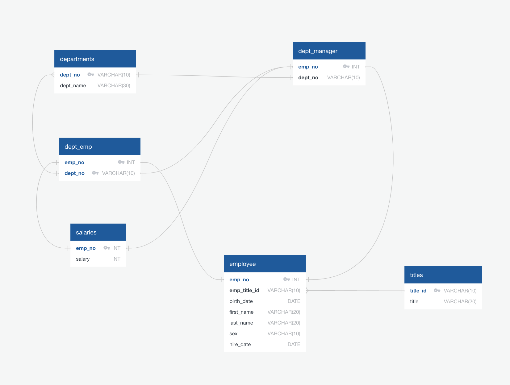
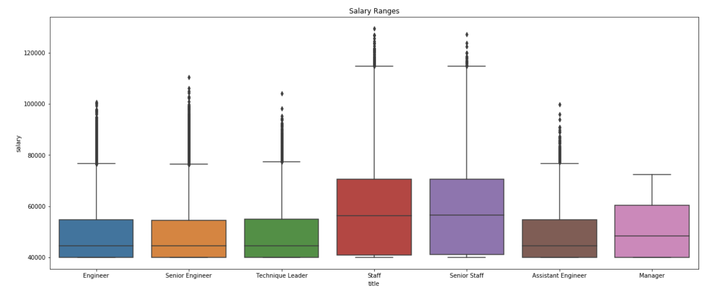
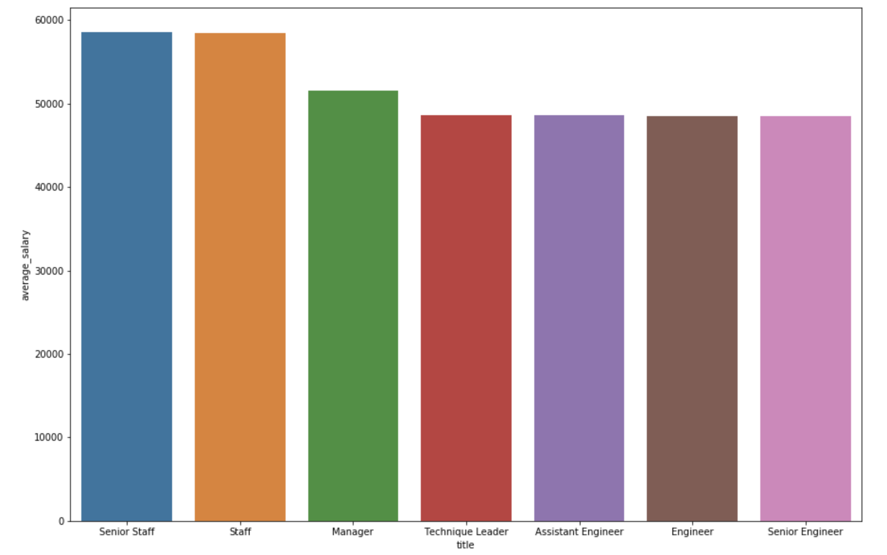

# SQL-challenge

## Overview: 
#### In this project, I designed a database in postgresql with seven tables, and then I query the data from the database, and performed some analysis about the data

## ERD

## Data Analysis 

